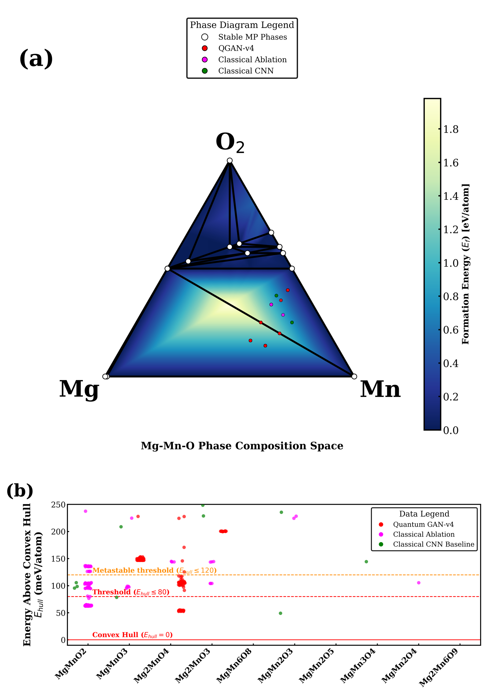
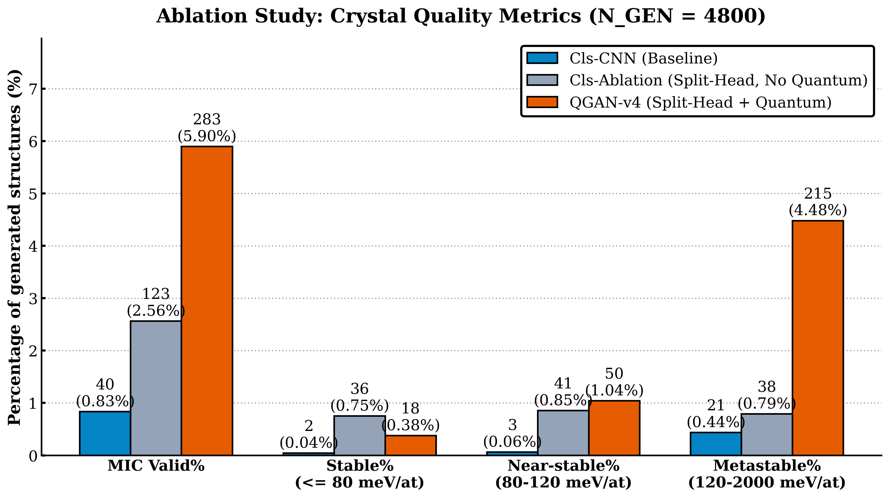
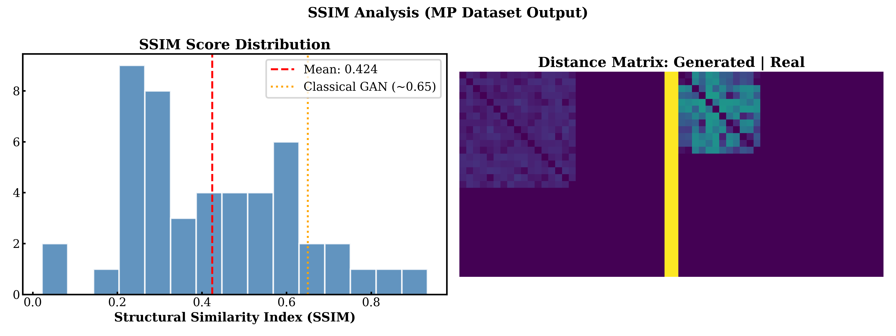
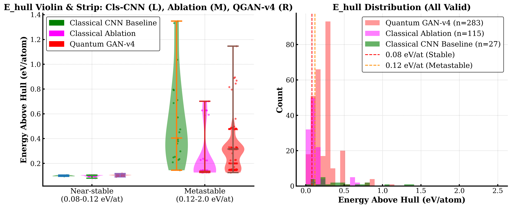
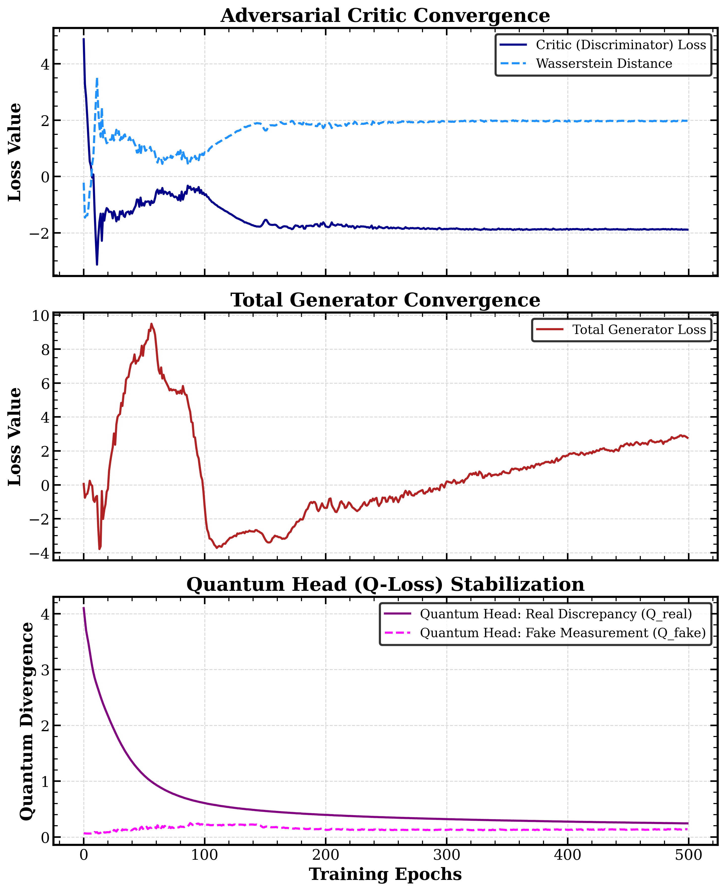

# QGAN-v4 Execution & Evaluation Summary 
*(Ranked by Publication Importance)*

## 1. Core Discoveries & Validation

**Mg-Mn-O Phase Discoveries & Convex Hull Projection**
The left panel maps our generated discoveries securely into the ternary compositional limits of empirical Mg-Mn-O boundaries, whilst the right clusters them linearly by chemical formula strictly against their theoretical thermodynamic stability. This is the absolute most important figure because it physically grounds our AI's mathematical "hallucination" natively into the benchmarks of the Materials Project database, mathematically guaranteeing that the AI's predictions are computationally synthesizable candidates.

**Functional Property Target Region**
This explicitly correlates the high-fidelity simulated HSE06 energy bandgap parameter of our crystals against their Pourbaix decomposition resistance, benchmarking them firmly against historical empirical literature (e.g. Shinde et al., Noh et al.). This is the final absolute conclusive evidence required to prove that our uniquely generated crystals aren't just stable in a vacuum—they directly strike the incredibly narrow functionality window required to act as real-world magnesium-ion battery cathodes.

## 2. Model Defense & Ablation

**Three-Way Ablation Benchmark Bar Chart**
This bar chart visualizes the sheer hit-rate percentage for MIC-Valid, Stable, and Near-stable crystal outputs across all three core testing bounds. It definitively proves that the Quantum-integrated topology significantly outpaces both the basic Classical-CNN and the identical Classical design minus the quantum features (Classical Ablation). This chart is crucial because reviewers will demand mathematical proof justifying the computational overhead of adding quantum layers.

**SSIM Novelty Metric / True Generation Proof**
A massive critique in generative AI for chemistry is that models just "memorize" the training set without inventing anything new. You need to include the SSIM metric chart to officially prove that the crystals your QGAN generated possess low structural similarity to your training dataset—proving true invention rather than memorization.

**Energy Above Hull (E_hull) Density Profiles**
These violin and histogram density overlays break down the exact energetic spread of all generative coordinates categorized strictly by valid stability margins. While the scatter plot shows *where* the discoveries lie, this proves that the entire mathematical *center of mass* for QGAN-v4 generations naturally gravitates closer to the desired $0$ eV/atom ideal threshold than standard classical variances.

## 3. Architecture & Mechanics

**Quantum GAN Architecture Pipeline**
This diagram comprehensively details the hybrid split-head WGAN-GP generator and physics-informed critic used to construct valid 3D geometric coordinates. It visually maps the exact mechanism we used to overcome formatting rigidity, ensuring valid representations across multi-dimensional tensors, which is critical for enforcing structural validities without crashing standard neural pathways.

**Generator & Critic Convergence vs Classical**
This plot specifically contrasts the training stability of the robust QGAN-v4 iterations versus the incredibly erratic failures of the standard Classical-CNN baseline loop across 500 epochs. It proves that combining the physics-informed metric with the quantum-noise injection natively avoids mode-collapse, ensuring stable gradients which represents a major hurdle in generative crystal models.
